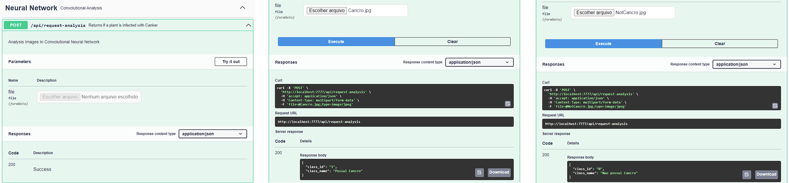

# Projeto Diagnóstico do Cancro Europeu da Macieira com Redes Neurais Convolucionais

Este projeto tem como objetivos:
- Realizar o treinamento de diferentes modelos pré treinados de Redes Neurais Convolucionais.
- Construir uma API em Flask que permita classificar imagens de Cancro Europeu da Macieira através de requisições REST.

## Demonstração



## Instalação

Clonar o repositório do GitHub.
```bash
$ git clone https://github.com/YanBurigo/TCC-Cancro.git
$ cd TCC-Cancro
```

Criar um Virtual Environment para a aplicação. Isto vai criar uma pasta dentro do projeto para colocar as bibliotecas necessárias para rodar a aplicação.
```bash
$ python -m venv env
```

Ativar o Virtual Environment no Windows
```bash
$ env\Scripts\activate.bat
```

Ativar o Virtual Environment no Linux
```bash
$ source env\bin\activate
```

Instalar as dependências presentes no arquivo `requirements.txt`
```bash
$ pip install -r requirements.txt
```

## Utilização

Inicializando o treinamento da rede neural para Windows e Linux:

- Execute o arquivo `main.py` dentro da pasta Neural Network
```bash
$ python "Neural Network\main.py"
```

Inicializando a API da rede neural para Windows e Linux:

- Execute o arquivo `run.py` dentro da pasta Neural Network API
```bash
$ python "Neural Network API\run.py"
```

Depois de inicializar a API, basta acessar http://localhost:7777 para poder testar a aplicação.

# Autores
* **Kevin Mondadori Mattos** - [Kevin-Mattos](https://github.com/Kevin-Mattos)
* **Yan Burigo Ribeiro** - [YanBurigo](https://github.com/YanBurigo)
* **Wilson Castello Branco Neto** - [wilsoncastello](https://github.com/wilsoncastello)
* **Carlos Andres Ferrero** - [anfer86](https://github.com/anfer86/)
